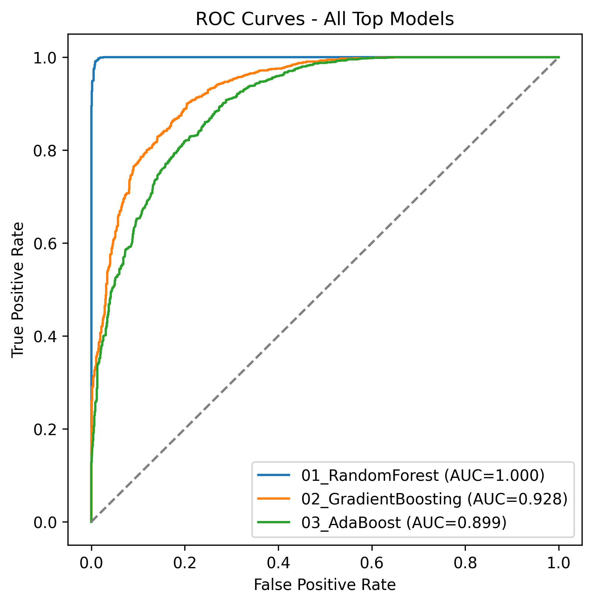
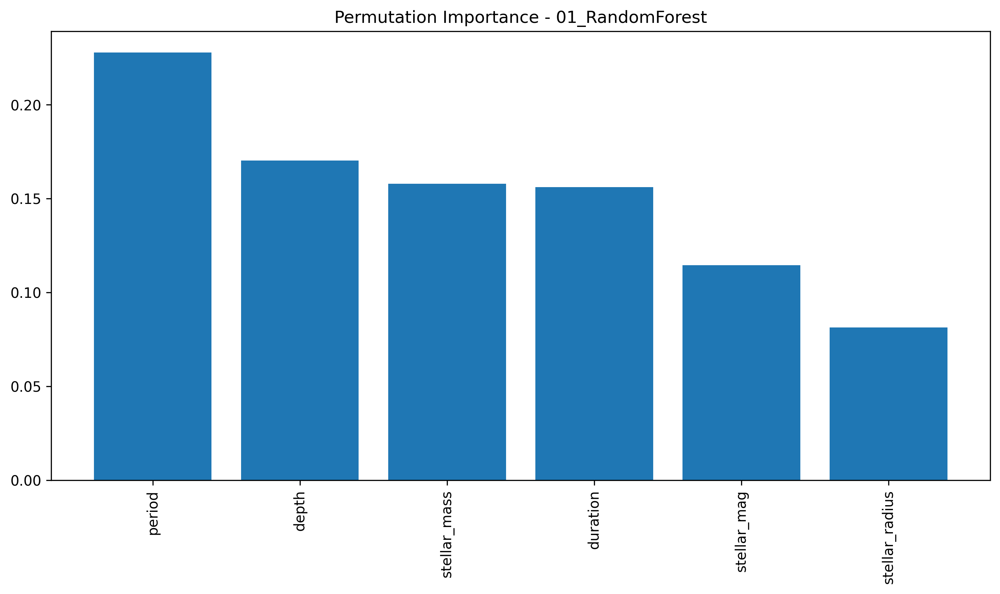
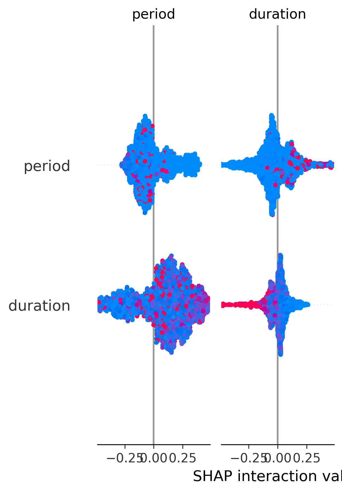
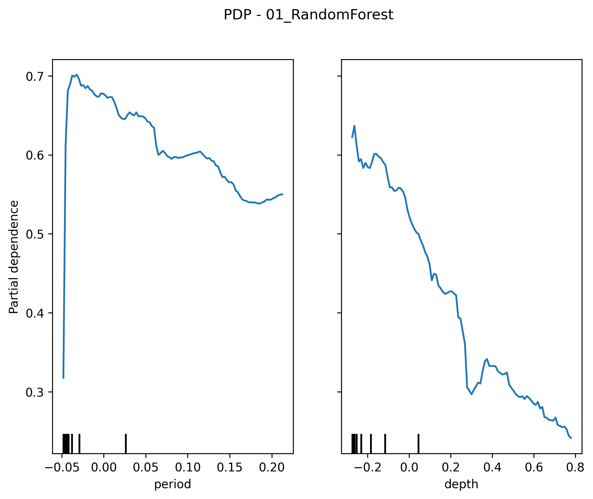
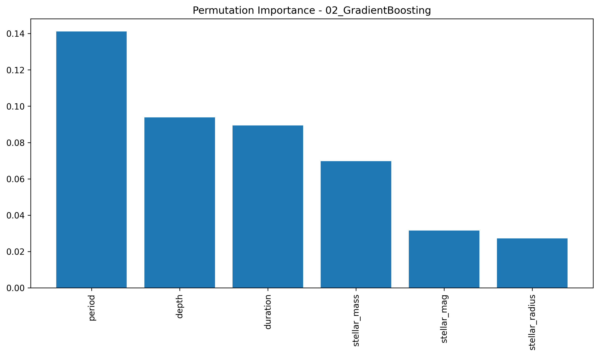
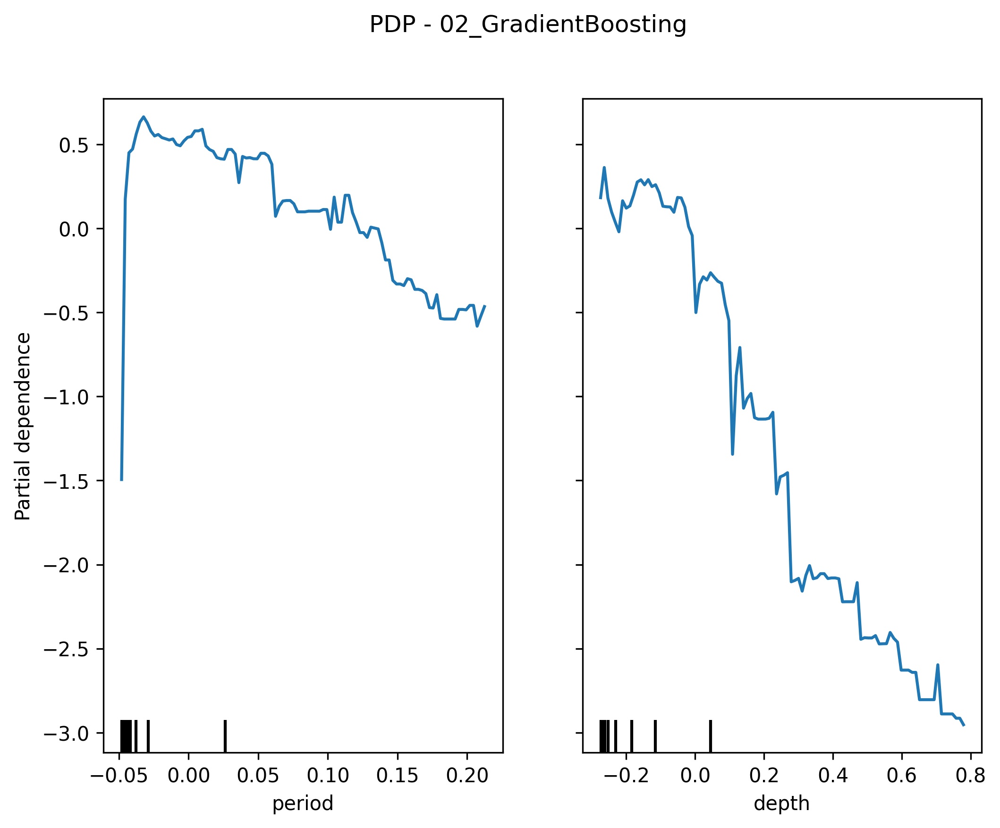
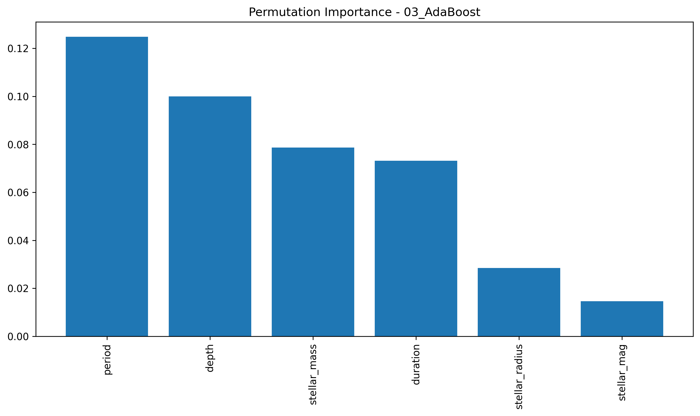
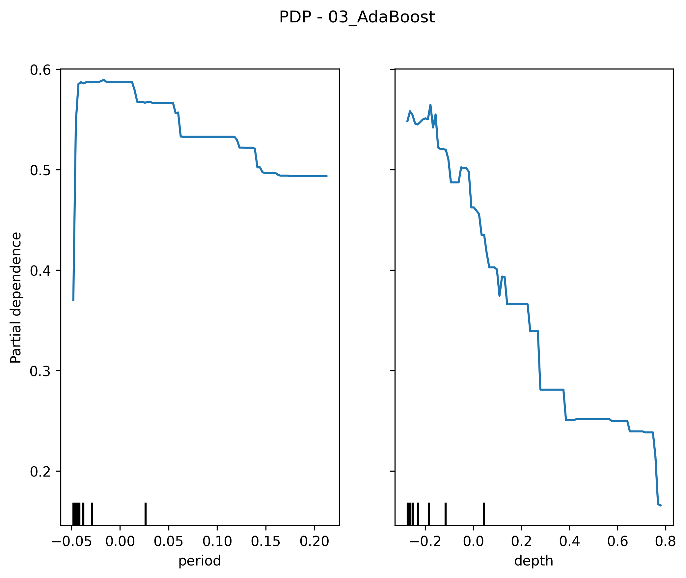

# Model Interpretation Report

This report summarizes the performance and interpretability analyses of the top models.

## Metrics Summary

| model               |   accuracy |   precision |   recall |       f1 |   roc_auc |
|:--------------------|-----------:|------------:|---------:|---------:|----------:|
| 01_RandomForest     |   0.983929 |    0.974937 | 1        | 0.98731  |  0.999523 |
| 02_GradientBoosting |   0.859783 |    0.84824  | 0.94473  | 0.893889 |  0.928054 |
| 03_AdaBoost         |   0.832061 |    0.817522 | 0.941517 | 0.875149 |  0.899351 |

## ROC Curves

## 01_RandomForest

### Permutation Importance

### SHAP Summary Plot

### Partial Dependence Plot

## 02_GradientBoosting

### Permutation Importance

### Partial Dependence Plot

## 03_AdaBoost

### Permutation Importance

### Partial Dependence Plot

